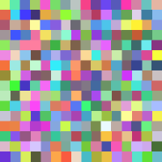

### PythonGen_SVGImage 

Scalable Vector Graphics(SVG) is an xml image format.  
These are examples to generate SVG images by using python.   
Reference: https://en.wikipedia.org/wiki/Scalable_Vector_Graphics  
SVG: https://www.w3.org/Graphics/SVG/

#### SVG images generated using python code 
 

