### PythonGen_SVGImage 

Scalable Vector Graphics(SVG) is a xml image format.   
Unlike the raster format, it never reduces clarity no matter how much you zoom it. 
These are interesting SVG images generated by using python.   
Reference: https://en.wikipedia.org/wiki/Scalable_Vector_Graphics  
SVG: https://www.w3.org/Graphics/SVG/
 
 
Please report any bugs at https://github.com/StevenHuang2020/PythonGen_SVGImage/issues

Practical data visualization resources：  
https://en.wikipedia.org/wiki/Data_visualization  
https://www.visualcinnamon.com/  
https://www.hongkiat.com/blog/svg-animations/  
https://informationisbeautiful.net/  
https://datavizproject.com/  

#### SVG images generated using python code  
|||
|---|---|
|||
||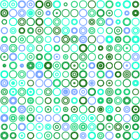|
|||
||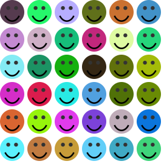|
|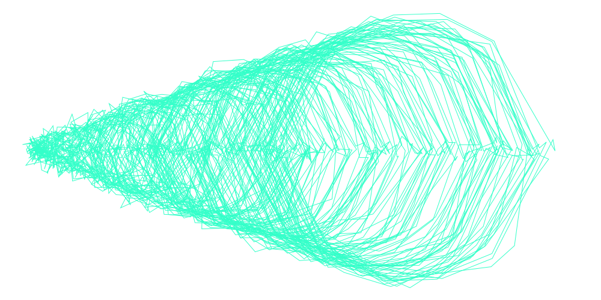|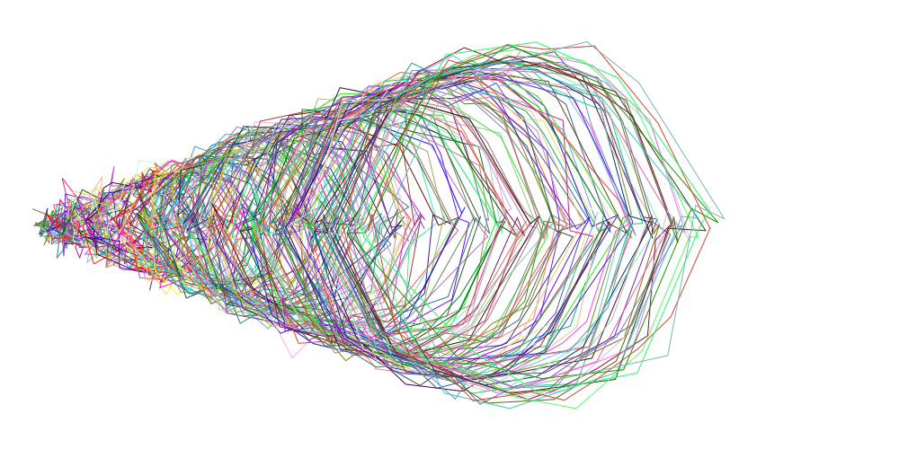|
|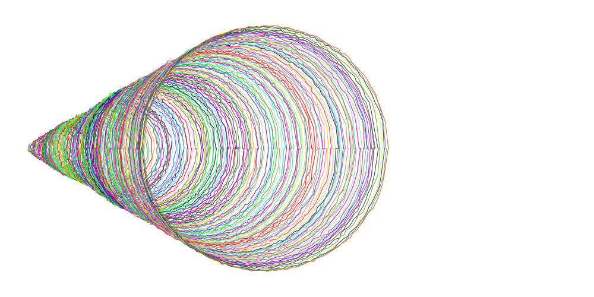||
||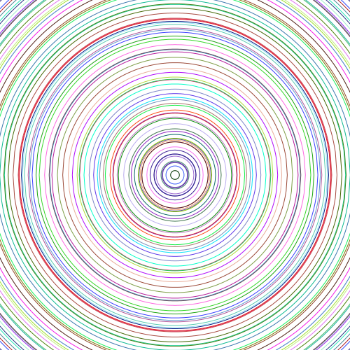|
||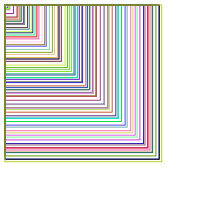|
|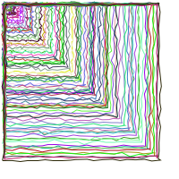|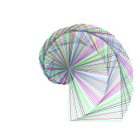|
|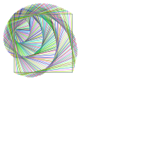|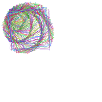|
|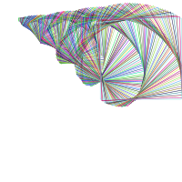|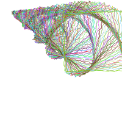|
|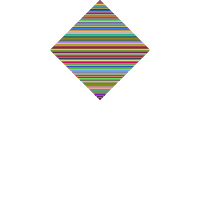|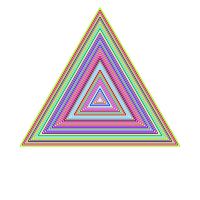|
|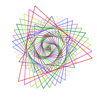|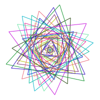|
||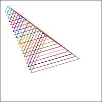|
|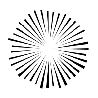|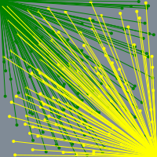|
|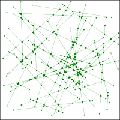|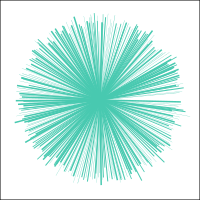|
|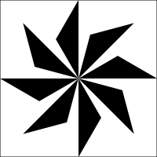|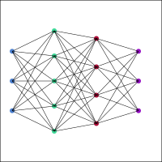|
|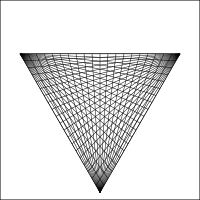|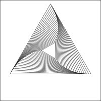
|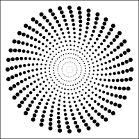|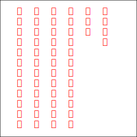|
|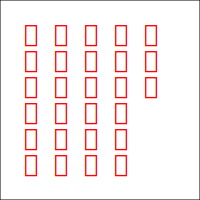|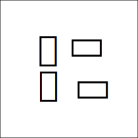|
|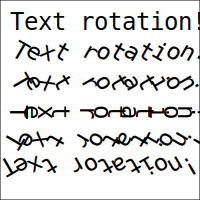|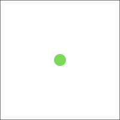|
|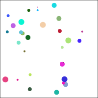|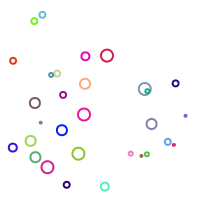|
|
|||