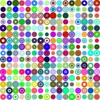
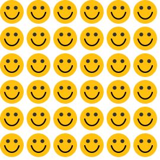

### PythonGen_SVGImage 

Scalable Vector Graphics(SVG) is a xml image format.   
These are interesting SVG images generated by using python.   
Reference: https://en.wikipedia.org/wiki/Scalable_Vector_Graphics  
SVG: https://www.w3.org/Graphics/SVG/

#### SVG images generated using python code 
 

