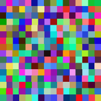
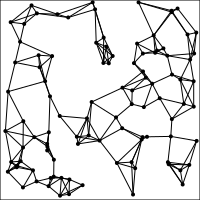

### PythonGen_SVGImage 

Scalable Vector Graphics(SVG) is a xml image format.   
These are interesting SVG images generated by using python.   
Reference: https://en.wikipedia.org/wiki/Scalable_Vector_Graphics  
SVG: https://www.w3.org/Graphics/SVG/
 
Please report any bugs at https://github.com/StevenHuang2020/PythonGen_SVGImage/issues

#### SVG images generated using python code 
 

<table>
   <tr>
    <td></td>
    <td></td>
   </tr> 
   <tr>
      <td></td>
      <td></td>
   </tr>
  <tr>
      <td></td>
      <td></td>
   </tr>
   <tr>
      <td></td>
      <td></td>
   </tr>
   <tr>
      <td></td>
      <td></td>
   </tr>
   <tr>
      <td></td>
      <td></td>
   </tr>
   <tr>
      <td></td>
      <td></td>
   </tr>
   <tr>
      <td></td>
      <td></td>
   </tr>
   <tr>
      <td></td>
      <td></td>
   </tr>
    <tr>
      <td></td>
      <td></td>
   </tr>
    <tr>
      <td></td>
      <td></td>
   </tr>
    <tr>
      <td></td>
      <td></td>
   </tr>
    <tr>
      <td></td>
      <td></td>
   </tr>
    <tr>
      <td></td>
      <td></td>
   </tr>
    <tr>
      <td></td>
      <td></td>
   </tr>
   <tr>
      <td></td>
      <td></td>
   </tr>
   
   <tr>
      <td></td>
      <td></td>
   </tr>
   <tr>
      <td></td>
      <td></td>
   </tr>
   <tr>
      <td></td>
      <td></td>
   </tr>
   
   
   <tr>
      <td></td>
      <td></td>
   </tr>
   <tr>
      <td></td>
      <td></td>
   </tr>
   <tr>
      <td></td>
      <td></td>
   </tr>
    <tr>
      <td></td>
      <td></td>
   </tr>
   <tr>
      <td></td>
      <td></td>
   </tr>
   <tr>
      <td></td>
      <td></td>、
   </tr>
   <tr>
      <td></td>
     
   </tr>
</table>
